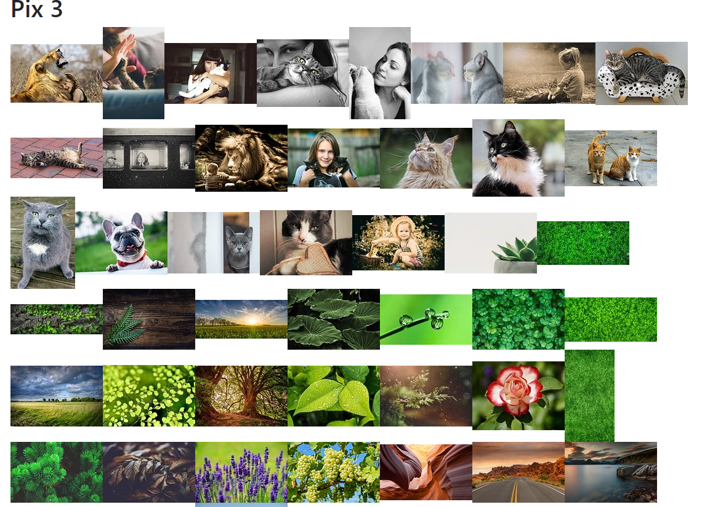

# Fetching Images



I used the node-fetch method to retrieve data from an external database, pixabay.

## Steps Involved

1. Created react app with `npx create-react-app nameapp`
1. Installed node-fetch `npm i node-fetch`
1. Added Bootstrap into index.html
1. Fetched API data 
1. Handled State with useState & useEffect
1. Add map function to loop through array and display many images

## My Array Map Example in React

```javascript
{animalImages.map((animal, index) => 
      
      )}
```

* index is the index value of the array, animalImages 
* use curly brackets to embed javascript in html